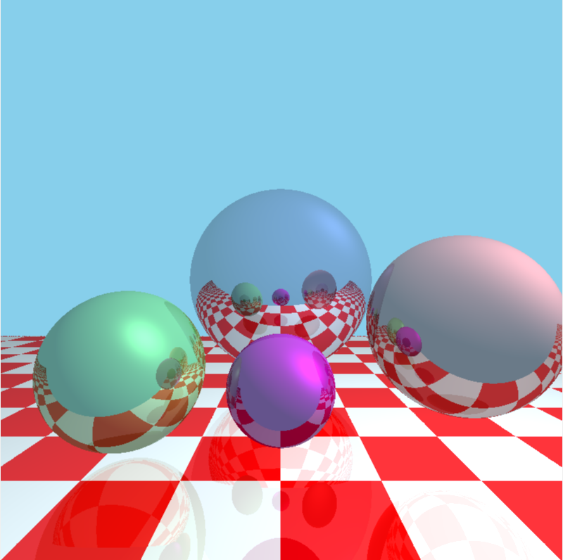

# PythonRaytracer
Created for Computer Graphics class at Louisiana Tech. This program renders objects (Spheres and a Plane) using a recursive ray tracing method. The ray tracing method is enhanced by implementing 4x oversampling as well as shadows with the use of shadow feeler rays

